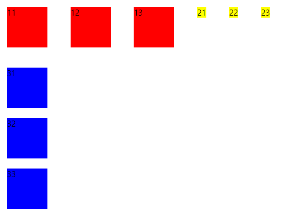
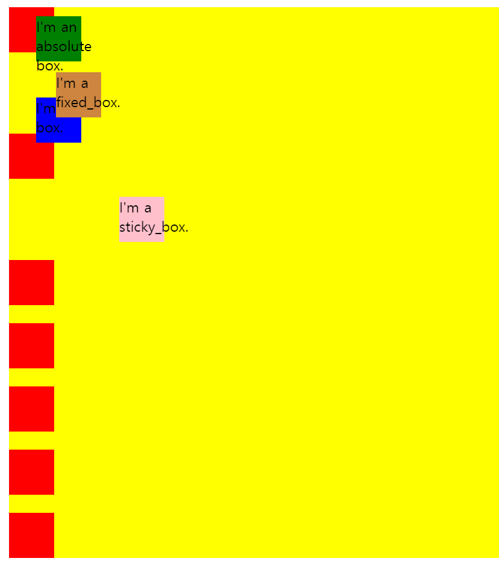

# CSS : Cascading Style Sheet

해당 문서에서는 position과 display에 
대해 서술한다. 박스 위에 박스가 stacking될 때 position과 display에 대해 잘 이해하고 있지 않으면 웹사이트의 구성이 쉽게 무너질 수 있다.

## 5. display
아래와 같은 html 문서가 있다고 하자.

```html
<!DOCTYPE html>
<html>
    <head>
        
        <meta charset="utf-8">
        <meta name="viewport" content="width=device-width">
        <title>title</title>
        <link rel="stylesheet" type="text/css" href="./display.css" />
    </head>

    <body>
        <!-- Block-level -->
        <div class="div_1">11</div>
        <div class="div_1">12</div>
        <div class="div_1">13</div>

        <div class="div_2">21</div>
        <div class="div_2">22</div>
        <div class="div_2">23</div>

        <!-- inline-level -->
        <span class="span_1">31</span>
        <span class="span_1">32</span>
        <span class="span_2">33</span>
        
    </body>
</html>

```

기본적으로 span은 inline level, div는 block level이다. 하지만 display를 통해 성질을 바꿀 수 있다.

```css
span, div{
    width:80px;
    height:80px;
    margin:20px;
}

div.div_1{
    background:red;
    display:inline-block;
}

div.div_2{
    background:yellow;
    display:inline;
}

span{
    background:blue;
    display:block;
}

```  

위의 css파일에 작성된 것 처럼, display에 올 수 있는 property는 block, inline, inline-block이 있다.  

inline은 css파일에서 width, height를 지정하더라도 '박스'가 아닌 '물건' 처럼, 내용물의 크기에 따라 background 색의 범위가 나타난다.  즉, css에서 지정한 width, height는 무시된다.

반면 block은 문자 그대로 block적인 성질을 가지고 있으므로 css에서 지정한 width, height를 따른다. 다만 기본 block은 한 줄에 한 개만 배치된다.  

inline-block으로 설정하면 block적인 성질은 가지고 있지만 inline으로 한 줄에 모두 배치되는 것을 확인할 수 있다.  


  
↑*display 결과*  


## 6. position

position으로 박스의 위치를 지정할 수 있다.


```html
<!DOCTYPE html>
<html>
    <head>
        <meta charset="utf-8">
        <meta name="viewport" width="device-width">
        <title>title</title>
        <link rel="stylesheet" type="text/css" href="./position.css">
    </head>
    <body>
        <article class="container">
            <div></div>
            <div class="box">I'm a box.</div>
            <div></div>
            <div class="sticky_box">I'm a sticky_box.</div>
            <div></div>
            <div class="absolute_box">I'm an absolute box.</div>
            <div></div>
            <div class="fixed_box">I'm a fixed_box.</div>
            <div></div>
            <div></div>
            <div></div>         
        </article>
    </body>
</html>
```

position 에는 static, relative, absolute, fixed, sticky가 있다.

```css
div{
    width:50px;
    height:50px;
    margin-bottom:20px;
    background:red; /*position 설정을 하지 않으면 기본적으로 static. html의 가장 기본 배치 문법을 따른다.*/
}

.container{
    background:yellow;
    left:20px;
    top:20px;
    position:relative;
}

.box{
    background:blue;
    left:30px;
    top:30px;
    bottom:30px;
    position:relative; /*static이었을 때 '원래 있어야할 장소'에서 '상대적으로' 얼마나 위치를 시킬지.*/
}

.absolute_box{
    background:green;
    top:10px;
    left:30px;
    position:absolute; /*absolute는 이 적용 범위가 담고 있는 가장 가까운 박스형의 top-left를 기준으로 위치를 정한다.*/
}

.fixed_box{
    background:peru;
    top:100px;
    left:80px;
    position:fixed; /*fixed는 상자를 완전히 벗어나 제일 최상위인 '윈도우'를 기점으로 위치를 정한다.*/
}

.sticky_box{
    background:pink;
    top:20px;
    left:150px;
    position:sticky; /*stkicky는 원래 있어야할 자리(static)에 있지만, 스크롤링을 해도 그 자리에 그대로 있는다.*/
}
```


  
↑*position 결과*  


이처럼, 최근에는 html과 css의 발달로 인해 강력한 기능들을 간단하게 쓸 수 있다. 주의해야할 점은 기능을 마구잡이로 쓰면 안되고 어떤 브라우저에서 쓸 수 있는지 호환성을 따지면서 써야한다는 것이다.

caniuse.com에 가면 각 속성들이 어떤 브라우저에서 쓰일 수 있는지, 또 전세계에서 얼마나 많은 사람들이 특정 브라우저를 쓰고 있는지 알 수 있으니 참고하자.