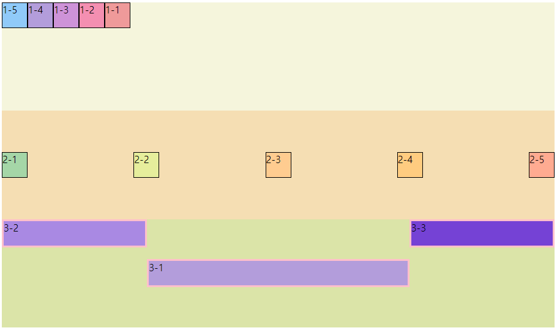

# Flexbox
>> flex box는 box와 item들을 행, 또는 열로 자유자재로 열거할 수 있도록 도와주므로 활용도가 매우 높다.

## 1. float  
flex box이전에는 float을 이용해서 박스들을 배치하곤 했다. float의 원래 목적은, 그림을 박스 안의 어디에 두고 싶느냐를 정하는 것이었지만, 본래의 취지와 맞지 않게 박스들의 레이아웃에 쓰이곤 했다.


↑*float : left 의 예시*  

그러나 이러한 쓰임은 본래의 float의 의미와는 전혀 다른 방식이다. 현대에 들어서는 flexbox가 레이아웃의 기능을 제공해주고 있으므로 float는 잘 쓰이지 않는다.


## 2. Flexbox

Flexbox에서 이해해야할 개념은 크게두가지이다.

1. 박스-아이템별 속성 분류  
2. main axis(중심축)과 cross axis(반대축))  

<br></br>

### 2-1-1. 컨테이너(box)에 적용할 수 있는 속성(attributes)들

- display
- flex-direction
- flex-wrap
- flex-flow
- justify-content
- align-items
- align-content

### 2-1-2. item에 적용할 수 있는 속성들

- order
- flex-grow
- flex-shrink
- flex
- align-self


### 2-2. main axis와 cross axis
Flexbox에서는 수직, 수평 축이 있는데, 둘 중 하나를 메인 축으로 선택하면 나머지 하나는 cross axis(반대축)이 된다. items는 메인 축을 따라서 정렬된다.


↑*main axis와 corss axis*
위의 예시에서는 수평 방향이 main axis가 되어있는 것을 알 수 있다. 이 때는 수직 방향이 cross axis가 된다.

 ## 3. flexbox 실전

```html
<!DOCTYPE html>

<html>
    <head>
        <meta charset="utf-8">
        <meta name="viewport" width="device-width">
        <title>flexbox</title>
        <link rel="stylesheet" type="text/css" href="./05-flexbox.css">
    </head>

    <body>
        <!--div.container1>div.item1.item1-${1-$}*5-->
        <div class="container1">
            <div class="item1 item1-1">1-1</div>
            <div class="item1 item1-2">1-2</div>
            <div class="item1 item1-3">1-3</div>
            <div class="item1 item1-4">1-4</div>
            <div class="item1 item1-5">1-5</div>
        </div>

        <div class="container2">
            <div class="item2 item2-1">2-1</div>
            <div class="item2 item2-2">2-2</div>
            <div class="item2 item2-3">2-3</div>
            <div class="item2 item2-4">2-4</div>
            <div class="item2 item2-5">2-5</div>
        </div>

        <div class="container3">
            <div class="item3 item3-1">3-1</div>
            <div class="item3 item3-2">3-2</div>
            <div class="item3 item3-3">3-3</div>
        </div>

    </body>
</html>
```


```css
/*
body, html{
    height: 100%;
}

.container1{
    background:beige;
    height:30%   /* %로만 하면, 그 상위 태그인
    body, html의 크기가 지정되지 않았기 때문에 아무런
    변화를 볼 수가 없다.
}
*/

/*기본적으로 height의 %의 의미는 이것으 부모 컨테이너의 크기의 특정 %만큼을 채우겠다
라는 의미이다.*/

.container1{
    background:beige;
    height:30vh; /*상위 태그인 html, body의 크기와 상관
    없이 실제 보이는 viewport의 30% 크기를 갖게 하겠다.*/
    display: flex;
    flex-direction: row-reverse; /*지정하지 않으면 기본은 row*/ 
    /*flwx-reverse 는 row이고 배치 순서를 reversed로 한다.*/
    flex-wrap: wrap; /*기본값은 nowrap. wrap하면 화면 줄일 시 다음줄로 넘어간다.*/
    /*flex-flow: row-reverse wrap; 으로 한번에 지정 가능.*/
    justify-content: flex-end;
    /*이외에도 flex-start, center등이 있다. 배치 순서에 영항 주지 않고
    순수하게 배치의 위치만 start인지 end인지 정한다.*/
    /*justify-content를 center로 지정하면 가운데 정렬한다.*/
    /*justify-content를 space-around를 하면 화면 넓이에 맞춰서 space를 준다. 첫번째 박스와 마지막 박스는 양 끝에 박스가 없으므로
    넓이 간격이 조금 다르다.*/
    /*justify-content를 space-evenly를 하면 모든 상자간/웹페이지 사이의 공간을 모두 똑같이 한다.*/
    /*justify-content를 space-btween을 하면 첫 번째, 마지막 박스는 회면 끝, 나머지는 균등한 거리륻 둔다.*/
}

.item1{
    width:40px;
    height:40px;
    border: 1px solid black;
}


.item1-1{
    background: #ef9a9a;   
}
.item1-2{
    background: #f48fb1;
}
.item1-3{
    background: #ce93d8;
}
.item1-4{
    background: #b39ddb;
}
.item1-5{
    background: #90caf9;
}

.container2{
    background: wheat;
    height: 30vh;
    display:flex;
    flex-direction: row;
    justify-content: space-between;
    align-items: center; /*align-items는 반대축(cross-axis) 기준으로 정렬을 정한다.*/
    /*align-items: baseline: items마다 padding이 다를 때 쓸 수 있다.*/

}

.item2{
    width:40px;
    height:40px;
    border: 1px solid black;
}


.item2-1{
    background: #a5d6a7;
}
.item2-2{
    background: #e6ee9c;
}
.item2-3{
    background: #ffcc90;
}
.item2-4{
    background: #ffcc80;
}
.item2-5{
    background: #ffab91;
}
/*색상 선정 : https://material.io/resources/color/#!/?view.left=0&view.right=0 참고.*/


.container3{
    background: #dbe4a8;
    height: 30vh;
    display: flex;
    flex-direction: row;
    justify-content: space-between;
}

.item3{
    height: 40px;
    width: 40px;
    border: 3px solid pink;
}

.item3-1{
    background: #b39ddb;
    order: 2;
    flex-grow: 2;
    flex-shrink: 1;
    align-self: center;  /* 해당 item만의 배치를 바꿀 수 있다.*/
}
.item3-2{
    background: #a989e3;
    order: 1;
    flex: 1 2 auto;
}
.item3-3{
    background: #7542d5;
    order: 3;
    flex: 1 2 auto;
}
```

아래는 코드의 결과이다.


↑*flexbox 결과*