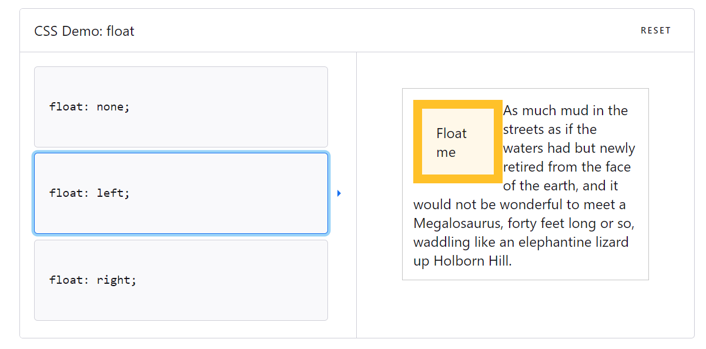
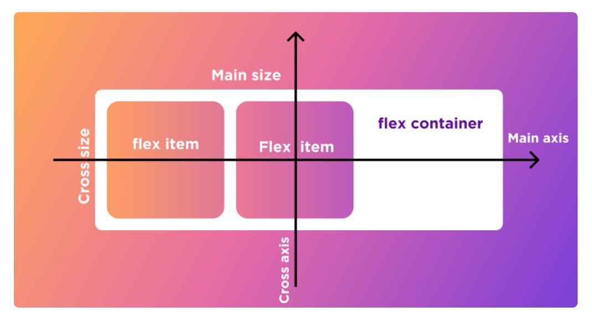

# Flexbox
>> flex box는 box와 item들을 행, 또는 열로 자유자재로 열거할 수 있도록 도와주므로 활용도가 매우 높다.

## 1. float  
flex box이전에는 float을 이용해서 박스들을 배치하곤 했다. float의 원래 목적은, 그림을 박스 안의 어디에 두고 싶느냐를 정하는 것이었지만, 본래의 취지와 맞지 않게 박스들의 레이아웃에 쓰이곤 했다.

↑*float : left 의 예시*  

그러나 이러한 쓰임은 본래의 float의 의미와는 전혀 다른 방식이다. 현대에 들어서는 flexbox가 레이아웃의 기능을 제공해주고 있으므로 float는 잘 쓰이지 않는다.

## 2. Flexbox

Flexbox에서 이해해야할 개념은 크게두가지이다.

1. 박스-아이템별 속성 분류  
2. main axis(중심축)과 cross axis(반대축))  

  

### 2-1-1. 컨테이너(box)에 적용할 수 있는 속성(attributes)들

- display
- flex-direction
- flex-wrap
- flex-flow
- justify-content
- align-items
- align-content

### 2-1-2. item에 적용할 수 있는 속성들

- order
- flex-grow
- flex-shrink
- flex
- align-self

### 2-2. main axis와 cross axis
Flexbox에서는 수직, 수평 축이 있는데, 둘 중 하나를 메인 축으로 선택하면 나머지 하나는 cross axis(반대축)이 된다. items는 메인 축을 따라서 정렬된다.

↑*main axis와 corss axis*

